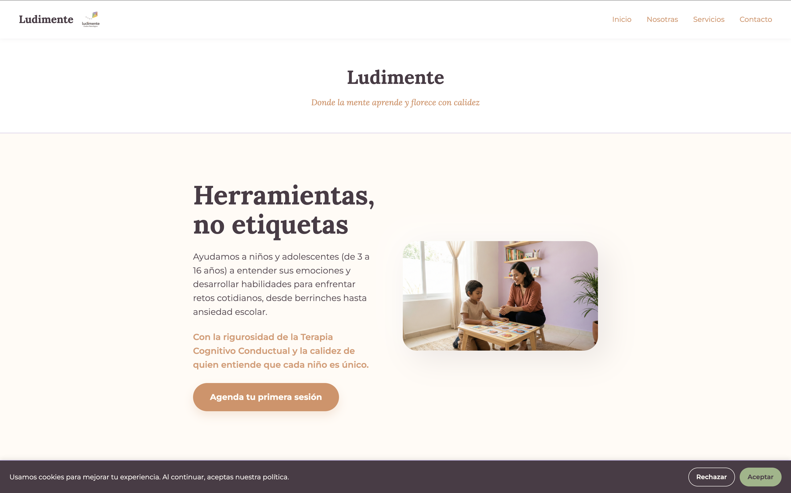
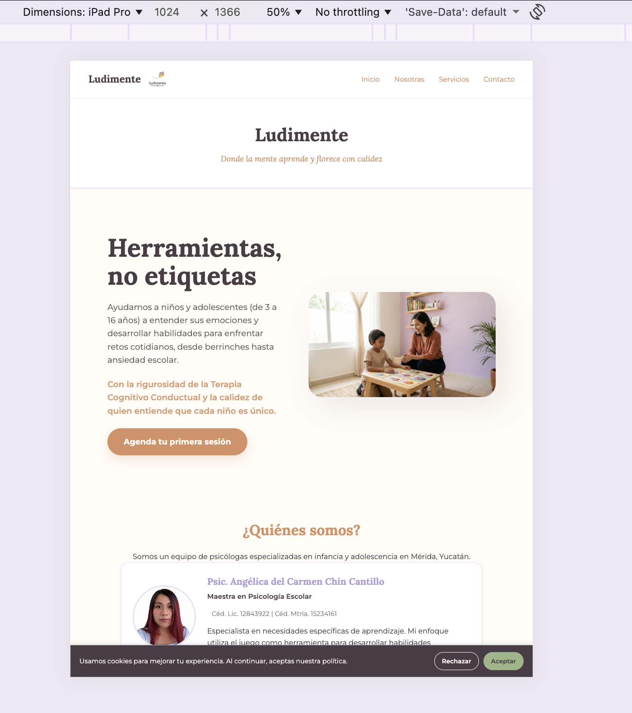
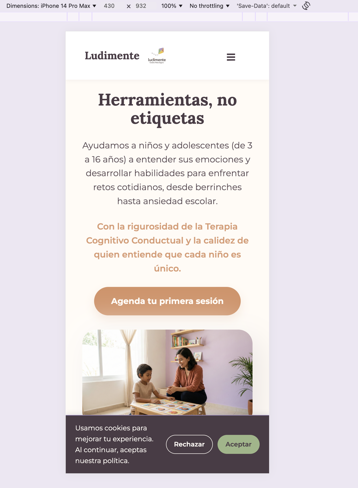
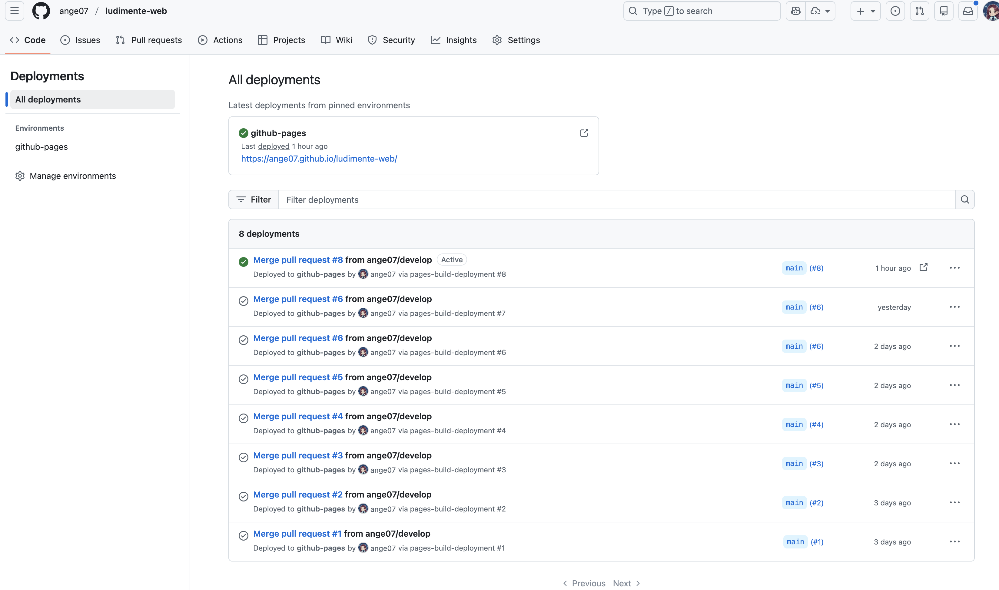

# Evidencias del Proyecto - Ludimente

Este documento contiene las evidencias de desarrollo y aprendizajes obtenidos durante el módulo de Desarrollo Web.

## Capturas de Pantalla

### Vista Desktop

### Vista Tablet

### Vista Móvil

## Despliegue

### Settings → Pages

---

## Aprendizajes

### 1. ¿Qué fue lo más fácil y lo más retador del proyecto?
Como desde hace semanas llevo preparando la identidad de Ludimente, un proyecto de psicología real que iniciare en enero de 2026, fue fácil aplicar los colores y la tipografía de mi marca. Ya tenía definida mi paleta de colores con variables CSS. Fue muy natural ir construyendo la identidad visual. También fue fácil la estructuración inicial con HTML semántico, ya que la lógica de secciones es sencilla para este tipo de landing pages. 

Lo más retador fue lograr un diseño moderno y responsivo. Fue un desafío asegurar que las imágenes y cards mantuvieran mi visión original, tanto en desktop como en móviles, sin colapsar el texto ni perder proporciones, lo cual requirió mucha prueba y error con flexbox y media queries.

### 2. ¿Qué partes de HTML semántico y Flexbox usaste y por qué?
HTML Semántico: Utilicé etiquetas como `<nav>`, `<header>`, `<main>`, `<section>`, `<article>` y `<footer>`. Esto no solo mejora el SEO y el acceso para lectores de pantalla, sino que hace que el código sea mucho más fácil de mantener.
Flexbox: Lo utilce sobre todo para el layout. Lo usé en el navbar para separar el logo de los links, en la cuadrícula de servicios y en el hero para la distribución de dos columnas que se transforman en una sola en dispositivos pequeños.

### 3. ¿Cómo organizaste tus media queries y breakpoints?
Organicé las media queries al final del archivo CSS. Utilicé un breakpoint principal en 768px (Tablet) para cambiar el layout de horizontal a vertical, y ajustes en tamaños de fuente y padding en 375px para asegurar que el contenido se viera bien en los teléfonos más pequeños.

### 4. ¿Qué mejorarías en una siguiente versión?
Me gustaría implementar animaciones con CSS como efectos de fade-in al hacer scroll, asimismo agregar un diseño para modo oscuro. Por otro lado, me gustaría enfocarme en la accesibilidad, porque no he probado con lectores de pantalla como es la navegación, y justo, mi profesión como psicóloga me inclina a hacer diseños accesibles universalmente. Y por ultimo, me gustaría hacer funcional el formulario de contacto.
